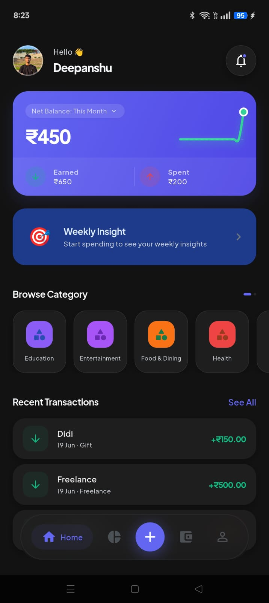
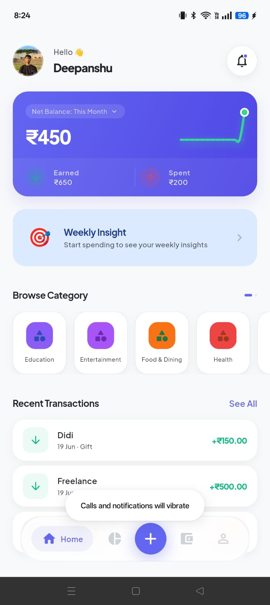
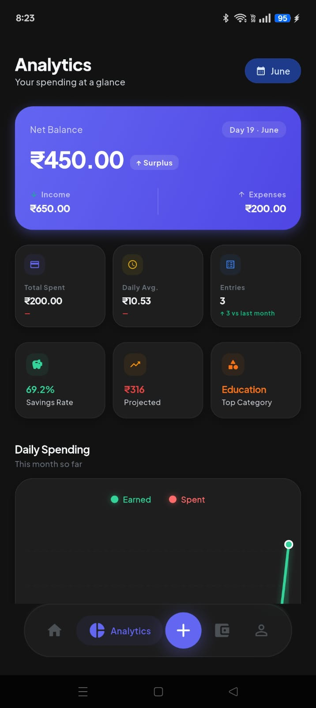
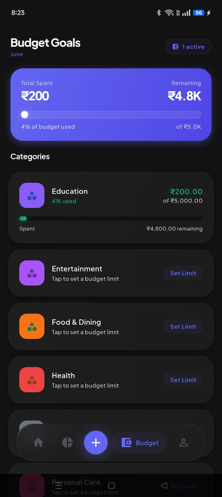
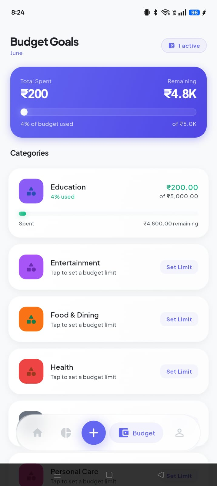
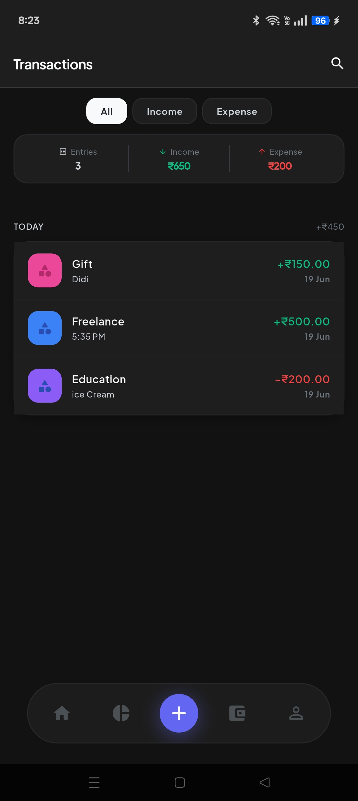
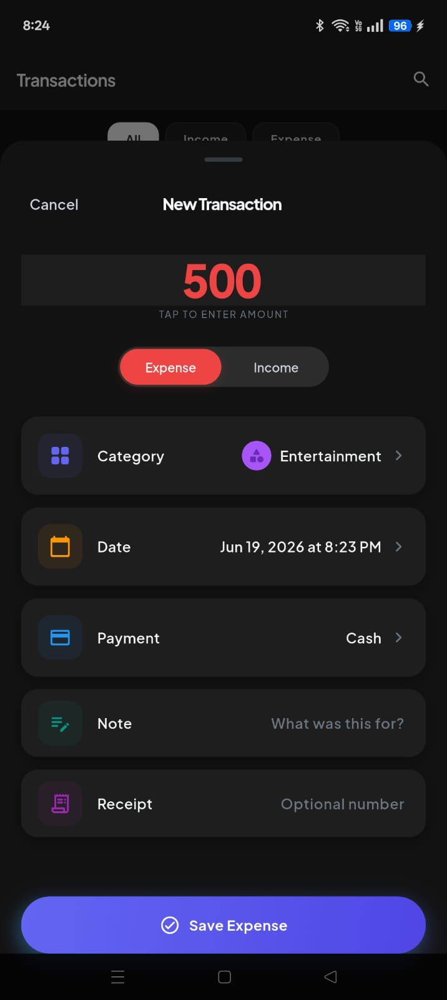
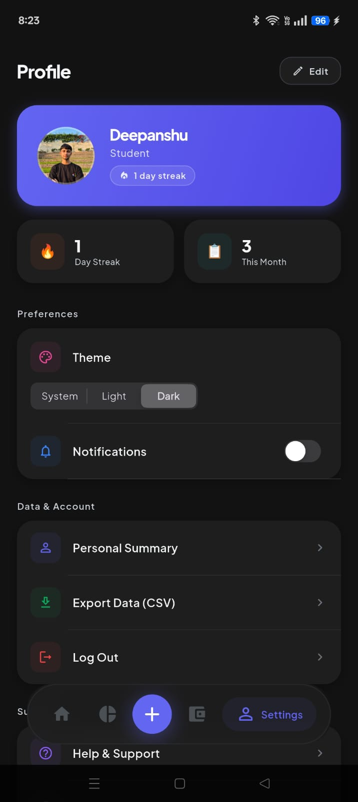

# 💸 FinTrack — Premium Personal Finance Tracker

<div align="center">
  
  
  
  
  
</div>

<br>

<div align="center">
  <a href="https://github.com/Deepanshu-ui-dev/Fintracker/releases/download/V1.1.0/FinTrack.apk">
    
  </a>
</div>

<br>

> FinTrack is a sophisticated, high-performance Flutter application designed to provide a **premium, state-of-the-art personal finance tracking experience**. Built with a severe focus on fluid UI, high-impact design, and robust local state management — it completely reimagines how you interact with your financial data.

**FinTrack is 100% Offline-First.** No loading spinners, no network requests — everything is instantaneous.

---

## 📱 Screenshots

<div align="center">

### 🏠 Dashboard
<table>
  <tr>
    <td align="center">
      
      <br><sub><b>Dashboard · Dark Mode</b></sub>
    </td>
    <td align="center">
      
      <br><sub><b>Dashboard · Light Mode</b></sub>
    </td>
  </tr>
</table>

### 📊 Analytics
<table>
  <tr>
    <td align="center">
      
      <br><sub><b>Analytics — Net Balance, Daily Spending Chart</b></sub>
    </td>
  </tr>
</table>

### 💰 Budget Goals
<table>
  <tr>
    <td align="center">
      
      <br><sub><b>Budget Goals · Dark Mode</b></sub>
    </td>
    <td align="center">
      
      <br><sub><b>Budget Goals · Light Mode</b></sub>
    </td>
  </tr>
</table>

### 🧾 Transactions
<table>
  <tr>
    <td align="center">
      
      <br><sub><b>Transactions — Grouped List</b></sub>
    </td>
    <td align="center">
      
      <br><sub><b>New Transaction Sheet</b></sub>
    </td>
  </tr>
</table>

### ⚙️ Settings & Profile
<table>
  <tr>
    <td align="center">
      
      <br><sub><b>Profile, Theme & Settings</b></sub>
    </td>
  </tr>
</table>

</div>

---

## ✨ UI/UX Design Philosophy

This application is engineered to feel **tactile, alive, and profoundly premium** — inspired by the "Invisible UI" principle used in world-class fintech apps:

| Principle | Implementation |
|---|---|
| **Glassmorphism & Depth** | `BackdropFilter` blurs on the floating nav pill and sheets; soft tinted glow shadows instead of harsh drop shadows |
| **Tactile Haptics** | Every core interaction triggers physical feedback — `lightImpact` for navigation, `mediumImpact` for saves/deletes, `selectionClick` for toggles |
| **Fluid Animations** | `BouncingButton` press-shrink, `AnimatedNumber` rolling counters, staggered list entries via `flutter_staggered_animations`, spring-curve progress bars |
| **Micro-Interactions** | Sliding income/expense toggle pill, pulsing FAB, animated budget progress bars that grow on first render |
| **Adaptive Layout** | Floating glassmorphic nav pill on mobile; two-column sidebar layout on desktop/web |
| **Dark & Light Modes** | Full dual-theme support with a single tap from Settings |

---

## 🚀 Key Features

### 💳 Dashboard
- **Balance Card** — gradient card showing Net Balance (Income − Expense) with animated sparkline graph
- **Earned / Spent breakdown** — live monthly income vs expense detail in the card footer
- **Daily Insight Banner** — AI-style weekly spending insight (% above/below personal average)
- **Budget Alert Banner** — real-time warnings when any category nears or exceeds its monthly limit
- **Browse Categories** — horizontally scrollable category grid with transaction drill-down

### 📊 Analytics
- **Net Summary Card** — net balance, income, expenses with surplus/deficit tag
- **Stat Pills** — Total Spent, Daily Average, Transaction Entries vs last month
- **Insight Mini-Cards** — Savings Rate %, Projected Monthly Spend, Top Category
- **Dual-Line Daily Chart** — animated bezier curves showing both Earned & Spent per day with glow effects
- **6-Month Trend Bar Chart** — green (income) vs red (expense) grouped bars with background tracks

### 💰 Budget Goals
- **Gradient summary card** — total spent vs remaining with an animated overall progress bar
- **Per-category budget cards** — green → amber → red progress bars as limits approach
- **Smart status labels** — "X% used", "Almost there", "Budget exceeded!" with colour coding
- **Set Budget Sheet** — big centered amount input with preset chips (1K, 5K, 10K…) and dynamic currency

### 🧾 Transactions
- **Grouped by date** with net daily total label per group header
- **Summary bar** showing filtered income, expense, and count totals
- **Swipe-to-delete** with animated removal and UNDO snackbar
- **Advanced filtering** — All / Income / Expense + category chip + live search
- **Add/Edit sheet** — borderless amount input, iOS-style form rows, haptic feedback throughout

### ⚙️ Settings & Profile
- **Gradient profile hero card** with streak badge and profile photo
- **Streak & entries stat cards** — gamification layer to build daily habits
- **Theme switcher** (System / Light / Dark) via segmented control
- **Notifications toggle**, **Biometric lock toggle**
- **CSV export** of all transactions via `ExportService`

---

## 🛠️ Tech Stack

| Layer | Technology |
|---|---|
| **Framework** | [Flutter](https://flutter.dev/) SDK 3.22+ |
| **State Management** | [Riverpod](https://riverpod.dev/) — `StateNotifierProvider`, `Provider`, `StateProvider` |
| **Local Database** | [Hive](https://docs.hivedb.dev/) — NoSQL TypeAdapters, synchronous reads/writes |
| **Routing** | [GoRouter](https://pub.dev/packages/go_router) — declarative, deep-linkable |
| **Charting** | [fl_chart](https://pub.dev/packages/fl_chart) — bezier line charts, bar charts with animations |
| **Animations** | `flutter_staggered_animations`, native `AnimationController` + `TweenAnimationBuilder` |
| **Notifications** | `flutter_local_notifications` + `timezone` |
| **Security** | `local_auth` biometric lock |
| **Internationalisation** | `intl` — dynamic locale & currency symbol via `NumExtension` |

---

## 📂 Project Structure

```text
lib/
├── app/
│   ├── app.dart              # Root widget, theme, currency initialisation
│   └── router.dart           # GoRouter config, AppShell (mobile + desktop nav)
├── core/
│   ├── constants/            # AppColors design system, AppTextStyles
│   ├── extensions/           # NumExtension (asCurrency, compactCurrency), DateExtensions
│   ├── utils/                # Breakpoints, Validators
│   └── widgets/              # BouncingButton, AnimatedNumber, BottomPadding
├── data/
│   ├── models/               # Hive TypeAdapters: Transaction, Category, Budget, User
│   ├── repositories/         # CRUD wrappers over Hive boxes
│   └── services/             # ExportService, HiveService, NotificationService
├── presentation/
│   ├── dashboard/            # Dashboard screen + BalanceCard, BrowseCategories widgets
│   ├── transactions/         # Transactions list, Add/Edit sheet, FilterChipsBar
│   ├── analytics/            # Charts: DailyLineChart, MonthlyBarChart, CategoryBreakdown
│   ├── budget/               # BudgetScreen + SetBudgetSheet
│   ├── settings/             # Settings & ProfileScreen
│   └── onboarding/           # Local onboarding flow
└── providers/                # All Riverpod providers (transactions, budget, auth, theme…)
```

---

## 🚀 Getting Started

### Prerequisites

- Flutter SDK (latest stable — 3.22+)
- Android Studio / VS Code with Flutter plugin

### Installation

1. **Clone the repository**:
   ```bash
   git clone https://github.com/Deepanshu-ui-dev/Fintracker.git
   cd Fintracker/Fintrack-Frontend
   ```

2. **Install dependencies**:
   ```bash
   flutter pub get
   ```

3. **Run code generation** (Hive adapters):
   ```bash
   dart run build_runner build --delete-conflicting-outputs
   ```

4. **Run the application**:
   ```bash
   # Android / iOS (recommended for haptics & 60fps blurs)
   flutter run

   # Linux desktop
   flutter run -d linux

   # Web
   flutter run -d chrome
   ```

> **Tip:** Run on a **physical device** to experience the full haptic feedback engine and silky-smooth glassmorphism blurs. Emulators do not simulate haptics accurately.

---

## ⬇️ Download

<div align="center">
  <a href="https://github.com/Deepanshu-ui-dev/Fintracker/releases/download/V1.1.0/FinTrack.apk">
    
  </a>
</div>

<br>

> Requires Android 5.0 (API 21) or higher.

---

## 🔑 Design Tokens

The entire app derives from a single `AppColors` design token class in [`lib/core/constants/app_colors.dart`](lib/core/constants/app_colors.dart) that adapts to dark/light mode automatically:

```dart
// Primary palette
Color get primary    => const Color(0xFF7C3AED); // Electric Violet
Color get secondary  => const Color(0xFF3B82F6); // Electric Blue

// Semantic
Color get incomeGreen => const Color(0xFF10B981); // Emerald
Color get expenseRed  => const Color(0xFFF43F5E); // Rose
```

All currency formatting is dynamic via `NumExtension.activeCurrencySymbol` — configured from the user's profile at startup.

---

<p align="center">
  <b>Developed with ❤️ by Deepanshu Kaushik</b><br>
  <sub>FinTrack — 2026</sub>
</p>
